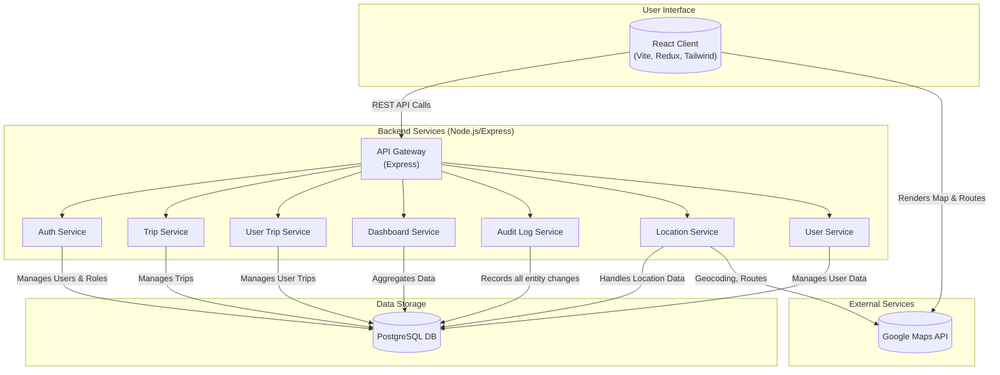

# Basis Transport Monorepo

[](https://deepwiki.com/basis-ltd/basis-transport)

A monorepo containing both the backend (API) and frontend (Client) applications for Basis Transport—a platform for bus tracking, trip management, and real-time fleet operations.

---

## Table of Contents

- [Monorepo Structure](#monorepo-structure)
- [Architecture Overview](#architecture-overview)
- [Key Features](#key-features)
- [Setup & Development](#setup--development)
- [API Documentation](#api-documentation)
- [Client Documentation](#client-documentation)
- [Contributing](#contributing)
- [License](#license)

---

## Monorepo Structure

```
basis-transport/
  api/      # Backend (Node.js, Express, TypeScript)
  client/   # Frontend (React, Vite, TypeScript)
  dev.sh    # Script to run both API and Client in development
```

---

## Architecture Overview

This project follows a client-server architecture where a React frontend communicates with a Node.js/Express backend via a REST API. The backend is designed with a service-oriented approach to separate concerns and improve maintainability.



---

## Key Features

### Real-time Trip Tracking with `MapView`
The platform offers a dynamic, real-time map visualization powered by Google Maps. The `MapView` component is central to the user experience, providing:
- **Live Location Tracking**: Displays live bus and user locations on an interactive map.
- **Dynamic Routing**: Calculates and displays the optimal route from the bus to the user, including distance and estimated time of arrival.
- **Context-Aware**: If a bus's live location isn't available, it intelligently defaults to showing the route from the trip's origin.

### Comprehensive Audit Trail
Every critical action within the system is captured through automated audit logs. This ensures full traceability and accountability for all data modifications.
- **Automated Logging**: Automatically records create, update, and delete events for key entities like `Trip`, `User`, and `TransportCard`.
- **Detailed Records**: Each log entry contains the action performed, the entity changed, who made the change, and a timestamp.

### User Trip Management
This feature enables detailed tracking of a user's journey within the transport network.
- **Boarding & Alighting**: Associates users with specific trips, managing their status from boarding to arrival.
- **Travel History**: Provides users with a history of their past trips.
- **Seamless Integration**: Connects users, trips, and transport cards into a cohesive experience.

### Dashboard & Analytics
The user dashboard provides at-a-glance insights into the transport system's operations through various analytical components.
- **Key Metrics**: Displays important KPIs, such as active trips, total users, and fleet status, in easily digestible cards.
- **Data Visualization**: Utilizes charts and graphs to represent trends and operational data over time.

### User Management & Email Notifications
The platform includes comprehensive user management features, complete with automated and visually consistent email notifications.
- **User Creation & Onboarding**: New users can be created with specific roles. Upon creation, an email is automatically sent with a temporary password and instructions.
- **Themed Email Templates**: Emails are styled to match the client's branding, ensuring a consistent user experience from the very first interaction.

### Other Core Features
- **Role-Based Access Control (RBAC)**: A robust, secure system for managing user permissions, ensuring users only access data and features appropriate for their role.
- **Transport Card Management**: A dedicated module for creating, assigning, and managing transport cards used for payments and identity.

---

## Setup & Development

### Prerequisites

- Node.js (v16+ recommended)
- npm (v8+ recommended)
- A running database (e.g., PostgreSQL)

### 1. Install Dependencies

From the root directory, run:

```bash
./dev.sh
```

This script will:
- Install dependencies for both `api` and `client`
- Start both servers concurrently (API and Client in development mode)

### 2. Environment Variables

#### API

- Copy `api/.env.example` to `api/.env` and fill in the required values:

```env
PORT=5000
DB_HOST=localhost
DB_PORT=5432
DB_USERNAME=postgres
DB_PASSWORD=postgres
DB_NAME=basis-transport
JWT_SECRET=your-jwt-secret
NODE_ENV=development
```

#### Client

- No special environment variables required for local development by default.

### 3. Running Individually

#### API

```bash
cd api
npm install
npm run dev
```

#### Client

```bash
cd client
npm install
npm run dev
```

---

## API Documentation

The backend is built with Node.js, TypeScript, and Express. It manages buses, routes, users, trips, and real-time tracking.

### Main Features
- User Authentication & Role-based Access Control
- Transport Card Management
- Trip & User Trip Management
- Automated Audit Logging

### Key Endpoints

#### Trip
- `POST   /trips` — Create a new trip
- `PATCH  /trips/:id` — Update a trip
- `DELETE /trips/:id` — Delete a trip
- `GET    /trips` — List trips (with filters)
- `GET    /trips/:id` — Get trip by ID
- `GET    /trips/reference/:referenceId` — Get trip by reference ID

#### UserTrip
- `POST   /user-trips` — Create a user trip (user boards a trip)
- `PATCH  /user-trips/:id` — Update a user trip
- `DELETE /user-trips/:id` — Delete a user trip
- `GET    /user-trips` — List user trips (with filters)
- `GET    /user-trips/:id` — Get user trip by ID

#### User
- `POST   /users` — Create a new user and send a welcome email
- `GET    /users` — Get a list of users
- `GET    /users/:id` — Get a user by their ID
- `DELETE /users/:id` — Delete a user

#### Audit Trail
- Automatic logging of create, update, and delete actions on entities, including who made the change and when.

---

## Client Documentation

The frontend is a modern React application using Vite, TypeScript, and Tailwind CSS.

### Tech Stack
- React 19
- TypeScript
- Vite
- Tailwind CSS
- Redux Toolkit
- Google Maps integration

### Project Structure

```
client/
  src/
    adapters/         # Storage and external adapters
    api/              # API logic (queries, mutations)
    components/       # Reusable UI components
    containers/       # Layout and navigation
    pages/            # Route-based pages (auth, dashboard, trips, etc.)
    states/           # Redux store, slices, hooks
    usecases/         # Business logic hooks
```

---

## Contributing

1. Fork the repository
2. Create your feature branch (`git checkout -b feature/YourFeature`)
3. Commit your changes (`git commit -am 'Add some feature'`)
4. Push to the branch (`git push origin feature/YourFeature`)
5. Create a new Pull Request

---

## License

[MIT](LICENSE)
